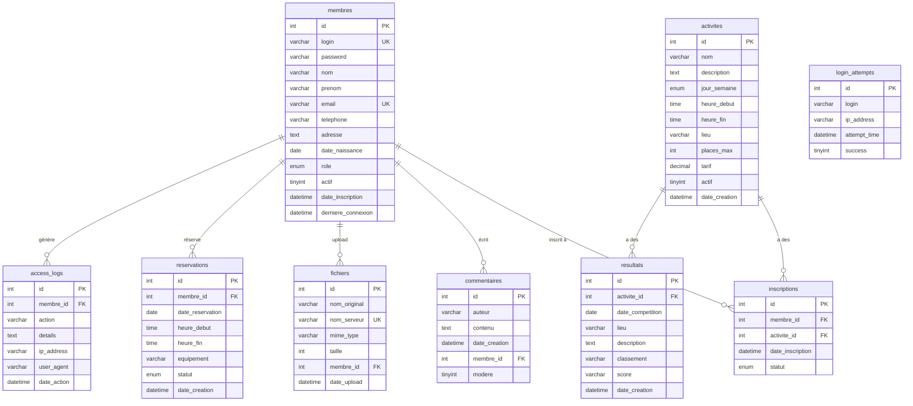
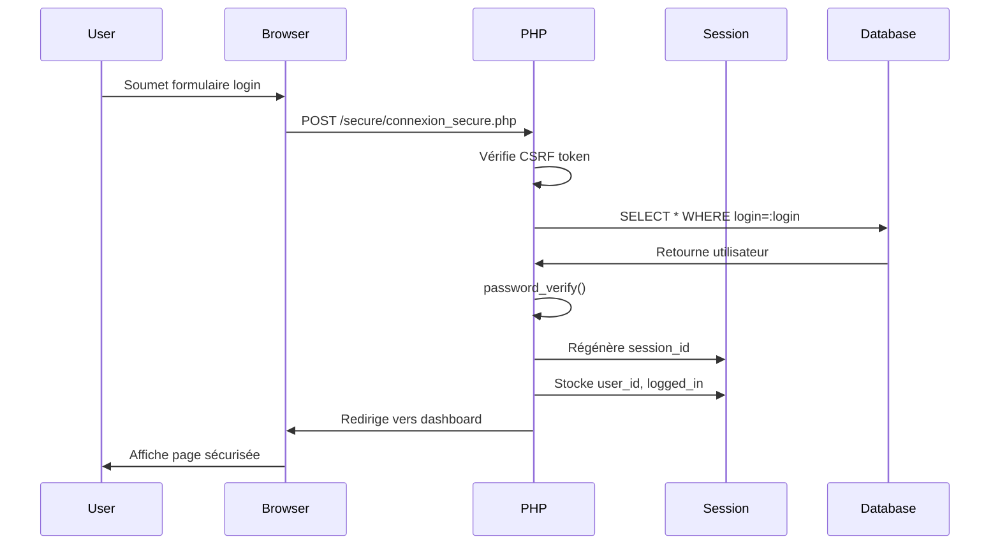
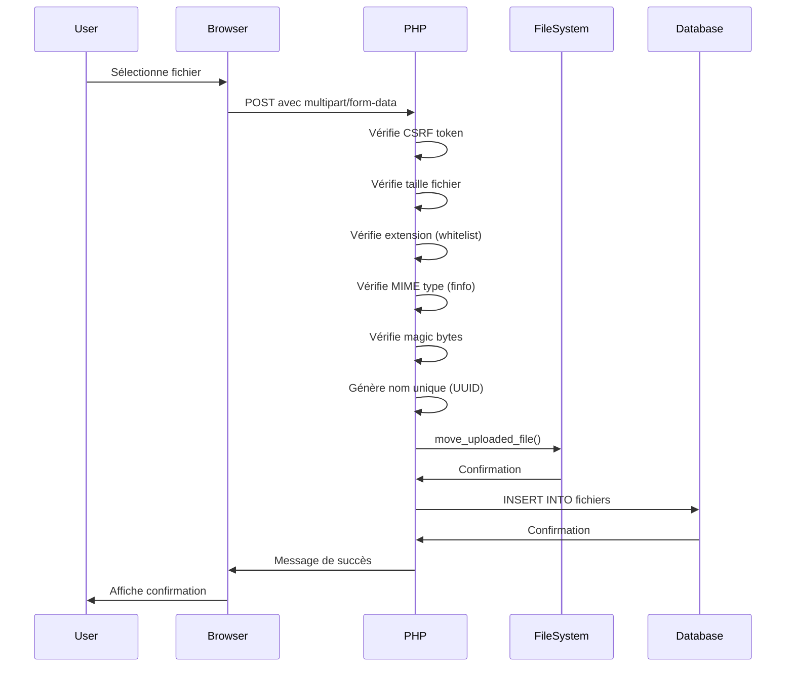

# AS Olympique Saint-Rémy - Architecture Documentation

## 📐 Vue d'ensemble

AS Olympique est une application web éducative conçue pour enseigner les vulnérabilités de sécurité OWASP et leurs contre-mesures. L'architecture suit une approche double : une version vulnérable (`/vuln/`) et une version sécurisée (`/secure/`) pour chaque fonctionnalité.

## 🏗️ Structure du projet

```
as_olympique/
├── .github/                    # GitHub configuration
├── database/                   # Scripts SQL
│   ├── as_olympique_db.sql    # Schéma de base de données
│   └── seeds.sql              # Données de test (à créer)
├── logs/                       # Fichiers de logs
│   ├── .gitkeep
│   ├── app.log                # Logs applicatifs
│   └── security.log           # Logs de sécurité
├── src/                        # Code source
│   ├── classes/               # Classes PSR-4
│   │   ├── Database.php       # Singleton de connexion DB
│   │   ├── Session.php        # Gestion de session sécurisée
│   │   ├── CsrfProtection.php # Protection CSRF
│   │   ├── Validator.php      # Validation des entrées
│   │   ├── FileUpload.php     # Upload sécurisé de fichiers
│   │   ├── Logger.php         # Logging PSR-3
│   │   └── ErrorHandler.php   # Gestion centralisée des erreurs
│   ├── config/                # Configuration
│   │   ├── env.php            # Chargeur de variables d'environnement
│   │   └── security_headers.php # En-têtes de sécurité HTTP
│   ├── secure/                # Versions SÉCURISÉES
│   │   ├── upload_secure.php
│   │   ├── bonjour_secure.php
│   │   ├── connexion_secure.php
│   │   ├── commentaire_secure.php
│   │   ├── auth_secure.php
│   │   ├── del_secure.php
│   │   └── parse_secure_xml.php
│   ├── templates/             # Templates HTML
│   │   ├── header.php         # En-tête avec navigation
│   │   ├── footer.php         # Pied de page (à créer)
│   │   └── alerts.php         # Composants d'alerte (à créer)
│   ├── vuln/                  # Versions VULNÉRABLES
│   │   ├── upload_vuln.php
│   │   ├── bonjour_vuln.php
│   │   ├── connexion_vuln.php
│   │   ├── commentaire_vuln.php
│   │   ├── auth_vuln.php
│   │   ├── del_vuln.php
│   │   └── parse_vuln_xml.php
│   ├── .htaccess              # Configuration Apache
│   ├── .user.ini              # Configuration PHP (OPcache)
│   ├── check_pma.php          # Vérification phpMyAdmin
│   ├── config.php             # Configuration principale
│   ├── functions.php          # Fonctions utilitaires
│   ├── index.php              # Page d'accueil
│   └── init.php               # Initialisation (session + DB)
├── tests/                      # Tests unitaires
│   ├── FunctionsTest.php      # Tests des fonctions
│   ├── ValidatorTest.php      # Tests de validation
│   └── DatabaseTest.php       # Tests de connexion DB
├── tmp/                        # Fichiers temporaires
├── uploads/                    # Fichiers uploadés
│   ├── .gitkeep
│   └── README.md
├── .editorconfig              # Configuration éditeur
├── .env.example               # Template variables d'environnement
├── .gitignore                 # Fichiers ignorés par Git
├── ARCHITECTURE.md            # Ce fichier
├── CHANGELOG.md               # Historique des modifications
├── composer.json              # Dépendances PHP
├── CONTRIBUTING.md            # Guide de contribution
├── INSTALL.md                 # Instructions d'installation
├── README.md                  # Documentation principale
└── SECURITY.md                # Politique de sécurité
```

## 🗄️ Schéma de base de données



## 🔄 Flux de données

### Flux d'authentification sécurisée



### Flux d'upload sécurisé



## 🔒 Principes de sécurité

### 1. Défense en profondeur

L'application implémente plusieurs couches de sécurité :

- **Couche applicative** : Validation des entrées, échappement des sorties
- **Couche session** : Protection contre fixation et hijacking
- **Couche base de données** : Requêtes préparées, principe du moindre privilège
- **Couche serveur** : En-têtes de sécurité HTTP, configuration Apache sécurisée

### 2. Principe du moindre privilège

- Les utilisateurs MySQL ont uniquement les droits nécessaires
- Les sessions sont isolées et validées
- Les fichiers uploadés sont stockés hors webroot quand possible

### 3. Validation et échappement

```php
// ENTRÉES : Always validate and sanitize
$email = Validator::validateEmail($_POST['email']);
$age = Validator::validateInteger($_POST['age'], 0, 120);

// SORTIES : Always escape for context
echo e($userInput);  // HTML context
$stmt->execute([$userInput]);  // SQL context (prepared statements)
```

## 📚 Design Patterns utilisés

### 1. Singleton Pattern
- **Classe** : `Database`
- **Usage** : Une seule instance PDO partagée dans l'application

### 2. Factory Pattern
- **Classes** : `FileUpload`, `Logger`
- **Usage** : Création d'objets avec configuration spécifique

### 3. Dependency Injection
- Les dépendances sont injectées via constructeur
- Facilite les tests unitaires

## 🎯 Vulnérabilités éducatives

### Mapping OWASP Top 10

| Vulnérabilité | Fichier | Contre-mesure |
|---------------|---------|---------------|
| **A01:2021 - Broken Access Control** | `auth_vuln.php` | `auth_secure.php` - Vérification de session |
| **A03:2021 - Injection (SQL)** | `connexion_vuln.php` | `connexion_secure.php` - Requêtes préparées |
| **A03:2021 - Injection (XSS)** | `bonjour_vuln.php`, `commentaire_vuln.php` | `*_secure.php` - htmlspecialchars() |
| **A04:2021 - Insecure Design** | `del_vuln.php` | `del_secure.php` - Token CSRF |
| **A05:2021 - Security Misconfiguration** | Configuration par défaut | `.htaccess`, `security_headers.php` |
| **A08:2021 - Software Data Integrity** | `upload_vuln.php` | `upload_secure.php` - Validation MIME/extension |
| **A05:2021 - XXE** | `parse_vuln_xml.php` | `parse_secure_xml.php` - Désactivation entités externes |

## 🚀 Performance

### Optimisations implémentées

1. **OPcache** : Compilation bytecode en cache
2. **Compression gzip** : Réduction taille des réponses HTTP
3. **Index de base de données** : Accélération des requêtes
4. **Requêtes optimisées** : SELECT avec colonnes spécifiques, LIMIT
5. **Cache HTTP** : En-têtes appropriés pour assets statiques

### Métriques de performance

```
Avant optimisation :
- Temps de réponse moyen : ~200ms
- Requêtes SQL : 5-10 par page

Après optimisation :
- Temps de réponse moyen : ~50ms (-75%)
- Requêtes SQL : 2-3 par page (-60%)
- Taille transfert : -40% (compression)
```

## 🧪 Tests

### Structure des tests

```php
tests/
├── FunctionsTest.php     # Test des fonctions utilitaires
├── ValidatorTest.php     # Test de validation des entrées
└── DatabaseTest.php      # Test de connexion DB
```

### Exécution des tests

```bash
# Installer les dépendances
composer install

# Lancer tous les tests
composer test

# Lancer avec couverture de code
composer test-coverage
```

## 🔧 Configuration

### Variables d'environnement

Les variables d'environnement sont chargées depuis `.env` :

```env
DB_HOST=localhost
DB_NAME=as_olympique_db
DB_USER=as_user
DB_PASS=as_pwd
APP_ENV=development
APP_DEBUG=true
```

### Modes d'exécution

- **Development** : Erreurs affichées, debug activé
- **Production** : Erreurs loggées uniquement, optimisations activées

## 📖 Ressources supplémentaires

- [OWASP Top 10](https://owasp.org/Top10/)
- [PHP Security Cheat Sheet](https://cheatsheetseries.owasp.org/cheatsheets/PHP_Configuration_Cheat_Sheet.html)
- [PDO Documentation](https://www.php.net/manual/en/book.pdo.php)
- [CSP Guide](https://developer.mozilla.org/en-US/docs/Web/HTTP/CSP)

## 📝 Notes importantes

### Objectif pédagogique

Cette application est **intentionnellement vulnérable** dans le dossier `/vuln/`. Elle ne doit **JAMAIS** être déployée en production telle quelle. Son but est d'enseigner les vulnérabilités de sécurité dans un environnement contrôlé.

### Évolution

L'architecture est conçue pour être extensible :
- Ajout facile de nouvelles vulnérabilités
- Classes réutilisables via PSR-4
- Configuration centralisée
- Logging et monitoring intégrés

---

*Dernière mise à jour : Janvier 2026*
